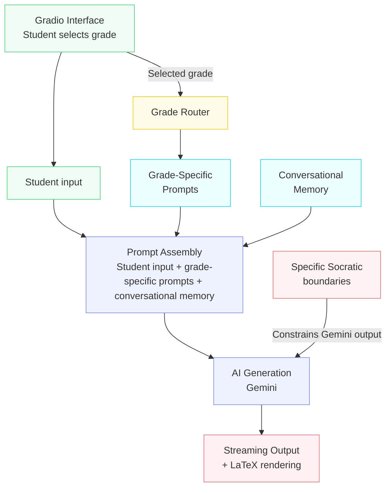
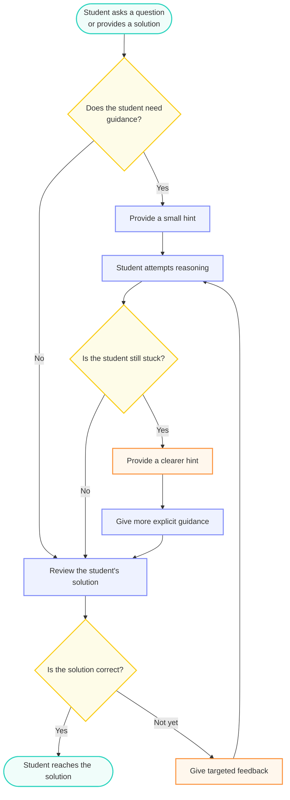
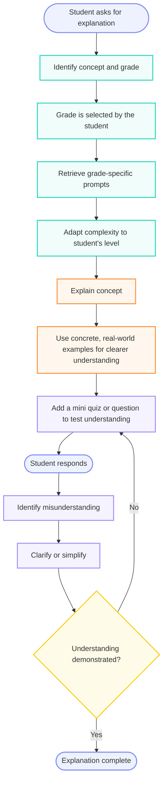
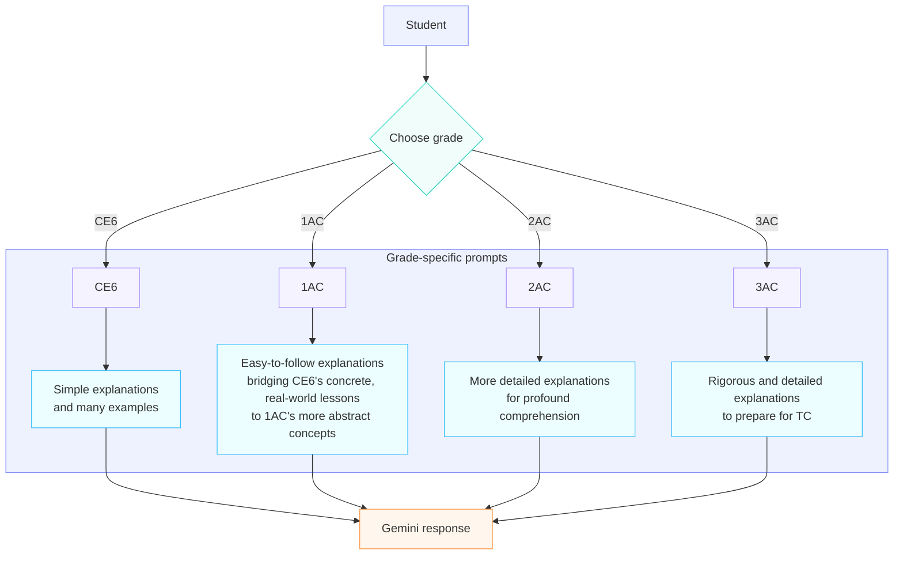
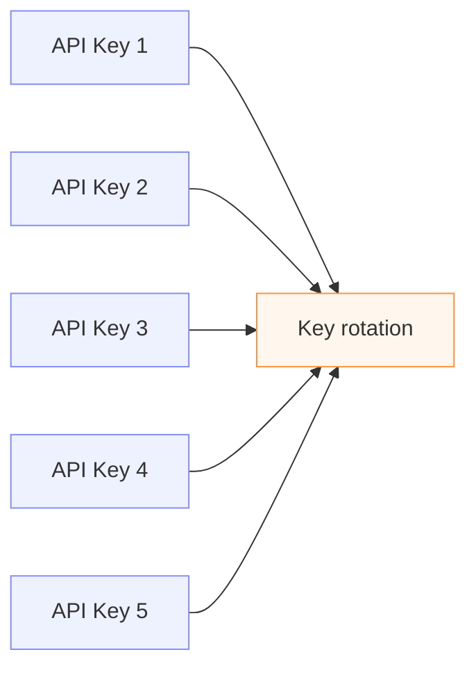
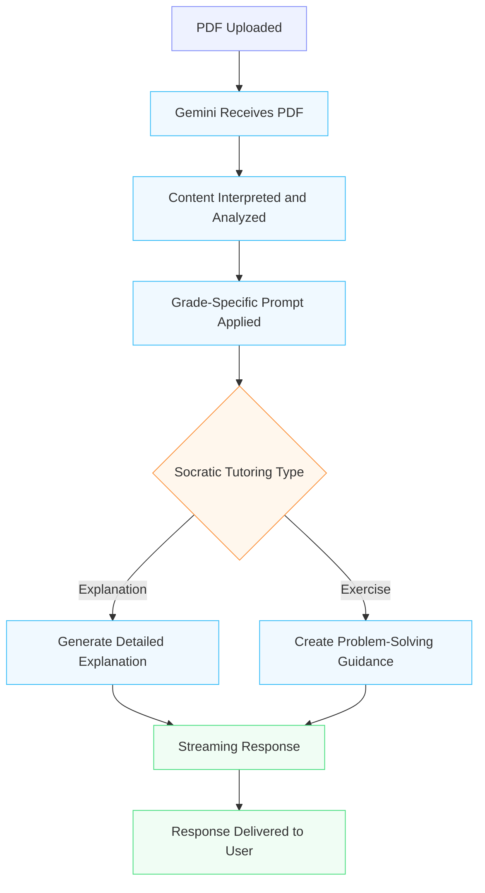

# AtlasKnowledge

AtlasKnowledge is an AI socratic engine specializing in the moroccan curriculum from CE6 to 3AC (6th grade to 9th grade).

This is a live demo of the apps interface, but you will need to enter your own keys: https://huggingface.co/spaces/TuteurIA/SYS_OPS_BK_V1/blob/main/app.py

This document will explain in detail how this model works.

## The Problem

Modern society has seen an invention that has changed the way we learn and think, and that invention is Artificial Intelligence. AI has affected the education sector greatly, where here in Morocco and the entire world, students use AI everyday for their studies, either for help, explanations or solutions. LLMs are great at solving problems, but this ability could undermine the students learning. Where a student asks for help and gets a direct solution instead of developing the method and cognitive ability to solve the problem. That's why I created AtlasKnowledge, which was designed thoroughly to make the LLM behave and act more like a tutor and teacher rather than an answer machine.

## What AtlasKnowledge Does

AtlasKnowledge is composed of two main system: the student system and the administrative system. For the students, it contains a variety of rich feature. Primarily its specialty in the Moroccan curriculum, grade specific behavior where it changes its explanation based on the level, Socratic questioning and exercise guidance which means that the engine actively questions the user and guides them using progressive hints instead of giving a direct solutions. It also includes detailed and easy to follow explanations, multilingual input and output, PDF input, LaTeX rendering when needed, conversational memory and real-world examples. AtlasKnowledge acts as a helper and teacher to the student, guiding them to the solution and developing their critical thinking skills. As for the administrative side, it features the ability to generate a comprehensive pedagogical report depending on the grade based on the students questions (Which are anonymized) to give the director a more clearer picture of the classrooms level.

## How AtlasKnowledge works

We will be using a diagram to give a clearer picture of the architecture works of AtlasKnowledge:

This Flow chart visualizes how the system works. The student chooses his specific grade (CE6 to 3AC) one time, the system puts that in lock. then he inputs his specific question. when he sends the message, it is bundled with the recent conversation history and the specific prompt for the grade chosen and the master prompt that has the socratic boundaries needed for the engine. all of this content is then transferred to the Gemini API, and finally the AIs output is passed into a latex renderer which is then outputted to the user as streamed content to give the illusion of instant reply.

## The Socratic Engine

The Socratic Engine is a core component of AtlasKnowledge, it is what distinguishes it from standard LLMs. To paint a clearer picture of the system, we will use two diagrams, one when the user asks a question or provides a solution, the other when they ask for an explanation

Diagram 1: Question or solution input from the user

As we can observe, the LLM first asks if the student needs guidance, if yes, then it will give progressive hints until the student finds the solution. if not, in the case of inputting solutions, if it is wrong, it will give constructive feedback

Diagram 2: asking for an explanation 

This flowchart demonstrates how AtlasKnowledge acts when the student wants an explanation, where it first adapts to the users grade, then explains thoroughly using useful examples, then adds at the end a small quiz or question to test the student, then it decides based on the answer given, whether to re explain more clearly or not.

## Curriculum adaptation

AtlasKnowledge uses specific pedagogical prompts for each grade level to facilitate clearer comprehension. and for 3AC rigorous explanations and exercises are needed to build the needed cognitive ability for Tronc Commun (First year of high school in Morocco). We put strong guardrails in place to make sure the engine doesn't drift off and give explanations that are too advanced for the specific grade. The interaction is also variable across the grades, whereas AtlasKnowledge expects a 3AC student to know negative and positive number addition and subtraction and doesn't expect a CE6 pupil to know these concepts.

## Curriculum Grounding

AtlasKnowledge is curriculum grounded by the master prompts. We explicitly tell the engine to primarily bring its info from well known Moroccan educational websites like Alloschool, Dyrassa and Moutamadris. We have implemented this to make AtlasKnowledges response more familiar to the student. Since if you ask a standard LLM i.e "Explain Vectors" it may add complex concepts not taught in 2AC or 3AC, while our engine outputs (depending on the grade) the exact concepts taught in that level.

## API Architecture

AtlasKnowledge API rotation technology to ensure stability of the engine. We will be using a diagram to detail the architecture of the system:

Diagram: API rotation Architecture:

AtlasKnowledge rotates through API keys to ensure maximum stability and availability and to improve resilience when individual keys face availability or usage constraints.

## PDF Interaction

AtlasKnowledge features PDF interaction where the student can upload a specific lesson or exercise to explain and to make the ideas clearer. We will be using a diagram to explain in detail the mechanics of this feature:

The user uploads a PDF to the app, then its contents get interpreted and analyzed. After that the grade specific prompt (determined by the grade chosen) gets bundled with the contents of the PDF. Then the engine determines if it is an explanation or an exercise, after that it applies the socratic constraints and outputs the response as streaming content to the user.

## Administration Mode:

AtlasKnowledge also features an administrative system as mentioned before. where the administration enters a specific protected password and chooses a grade. Then the users and a separate pedological report prompt gets bundled with the students anonymized data and gets sent to the engine which analyzes the data and outputs a comprehensive report including students most asked questions and confusing concepts, and advice to the professors and the administration of the school to paint a clearer picture of the educational state of the classroom.

## Tech Stack:

| Component           | Technology             |
| ------------------- | ---------------------- |
| Language            | Python                 |
| Interface           | Gradio                 |
| AI                  | Google Gemini API      |
| Mathematical output | LaTeX                  |
| Deployment          | Hugging Face Spaces    |
| Memory              | Conversational history |
| Document input      | Gemini PDF processing  |

- We chose python as the language for its compatibility with many AI libraries and the google-genai SDK.
- We implemented Gradio as the UI and UX for its focus on AI apps
- We used the Gemini API as the engine for its ability to process multimodal and multilingual inputs and its stability
- We deployed on HF spaces for the reliability of world-class servers
- We decided using native Gemini PDF processing feature to make the link between PDF input and the engine seamless.

## Project Architecture

AtlasKnowledge is divided into 5 main python files:

- main.py:
